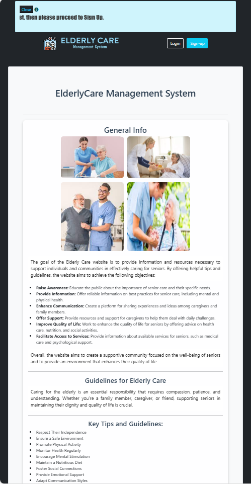

# 🧓 Elderly_Care_Managemen_ System

## 📖 About the Project
The **Elderly Care Management System** is designed to improve the quality of life for elderly individuals by providing tools for effective management and monitoring. This system facilitates caregivers, family members, and medical staff to collaborate seamlessly in delivering care to seniors.

---

## 🌟 Key Features
- **Elderly Profile Management**: Create, update, and manage elderly profiles with detailed information.
- **Health Records**: Track vital signs, prescriptions, health conditions, and medical notes.
- **Emergency Alerts**: Notify family members or caregivers in case of emergencies.
- **Roles & Permissions**: Manage roles for administrators, doctors, caregivers, and family members.
- **Medication Scheduling**: Specify medication times (morning, lunch, dinner) for elderly patients.
- **Multilingual Support**: Available in English and Arabic for better accessibility.
- **Reports**: Generate detailed reports for elderly care plans and health monitoring.

---

## 📸 Screenshots
### Homepage





### Admin Dashpoard


### Care Giver


### User Management


### Emergency Alerts


### Elder Profile Management 


### Elder Helth Recored


### Employee Management 

### Employee Tasks Management


### Eidt Employee Record


### Medication Schedules

---

## 🛠️ Technologies Used
- **Frontend**: HTML, CSS, JavaScript.
- **Backend**: PHP.
- **Database**: MySQL (managed using phpMyAdmin).
- **Version Control**: Git and GitHub.
- **Other Tools**: Agile methodology for project development.

---

## 📋 System Requirements
- **Web Server**: Apache/Nginx.
- **PHP Version**: 7.4 or higher.
- **Database**: MySQL 5.7 or higher.
- **Browser**: Modern browser supporting HTML5 and CSS3.

---

## 🚀 Installation Guide
1. **Clone the Repository**:
    ```bash
    git clone https://github.com/your-username/elderly-care-management-system.git
    ```
2. **Set Up the Database**:
    - Import the SQL file from `database/elderly_care.sql` into your MySQL server.
3. **Configure the Database**:
    - Update the database connection settings in `db_connection.php`.
4. **Run the Application**:
    - Host the project on a local server (e.g., XAMPP, WAMP) or deploy it to a live server.
5. **Access the System**:
    - Open your browser and navigate to `http://localhost/elderly-care-management-system`.

---

## 👤 Roles in the System
- **Admin**: Manages all system activities, including user roles and permissions.
- **Doctor**: Updates health records and adds medical notes.
- **Caregiver**: Monitors elderly health and manages daily activities.
- **Family Member**: Views elderly profiles and health updates.

---

## 📚 Documentation
For detailed documentation, refer to the `docs` folder.

---

## 📞 Contact
- **Developer**: Ala Al_Dain
- **Email**: [ala.al.dain2000@gmail.com](mailto:ala.al.dain2000@gmail.com)
- **Phone**: +917558575378

---

## 🤝 Contributions
Contributions are welcome! Feel free to submit a pull request or report any issues.

---

## 📝 License
This project is licensed under the [MIT License](LICENSE).
=======

